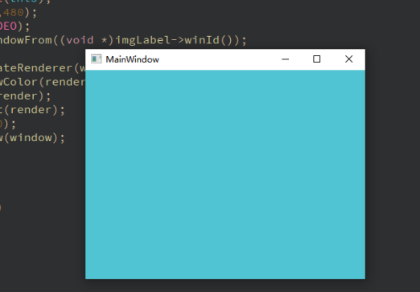

# 实现在Qt窗口中嵌套SDL

在现代软件开发中，多媒体处理和交互性成为应用程序不可或缺的一部分。Qt作为一个强大的GUI框架，为开发者提供了丰富的图形、界面和事件处理工具。然而，有时候，我们可能需要更多的多媒体功能和更高的性能，而这就是SDL（Simple DirectMedia Layer）的用武之地。在本文中，我们将探讨如何在Qt窗口中嵌套SDL，以便在应用程序中拓展多媒体体验和性能。

## SDL

SDL是一个跨平台的多媒体库，专门用于处理音频、图形、输入等多媒体操作。它提供了许多功能，如窗口管理、图像渲染、音频播放等。虽然SDL本身可以单独使用，但将其嵌套到Qt应用程序中，可以充分利用两者的优势。

## 嵌套SDL的好处

### 1. 多媒体支持

SDL为开发者提供了强大的多媒体功能，包括音频、图形和输入的处理。当应用程序需要更高级的音频/视频处理、游戏元素或其他多媒体功能时，SDL可以作为Qt的补充，为用户带来更加丰富的体验。

### 2. 性能优势

在某些场景下，SDL可能在性能方面更加优越。特别是在实时图形渲染、音频处理等方面，SDL的性能可能更出色。将SDL嵌套到Qt应用程序中，可以充分利用SDL的性能优势，提供更流畅的体验。

### 3. 特定平台功能

尽管Qt本身具有跨平台的特性，但有时我们可能需要访问特定平台的底层功能。通过在Qt应用程序中嵌套使用SDL，我们可以更灵活地控制和适应特定平台的功能，以满足特定需求。

### 4. 游戏和交互体验

对于需要实现游戏元素、交互性高的应用程序，SDL可能更适合处理这些需求。SDL专门设计用于游戏开发和多媒体处理，因此在Qt应用程序中嵌套使用SDL可以为用户带来更具娱乐性和交互性的体验。

## 具体实现

在不需要将SDL2窗口嵌入Qt时，创建SDL窗口只需要:
```cpp
SDL_Window *window = SDL_CreateWindow("SDL2 window",100,100,640,480,SDL_WINDOW_SHOWN);
```
在需要将SDL2窗口嵌入Qt时
```cpp
Label *imgLabel;
...
SDL_Window *window= SDL_CreateWindowFrom((void *)imgLabel->winId());
```
需要注意的是，由于Qt和SDL都有自己的事件循环，所以如果在主线程中渲染SDL窗口，会造成事件循环冲突，导致SDL窗口无法渲染。所以在创建完SDL窗口后，需要将渲染工作放到子线程中去完成。

### 代码示例
新建一个Qt Widget Application项目
mainwindow.h
```cpp
#ifndef MAINWINDOW_H
#define MAINWINDOW_H

#include <QMainWindow>
#include "SDL.h"
#include <QLabel>
#include <thread>

namespace Ui {
class MainWindow;
}

class MainWindow : public QMainWindow
{
    Q_OBJECT

public:
    explicit MainWindow(QWidget *parent = 0);
    ~MainWindow();

    QLabel *imgLabel;
    SDL_Window *window;
    SDL_Renderer *render;

private:
    Ui::MainWindow *ui;
};

#endif // MAINWINDOW_H
```
mainwindow.cpp
```cpp
#include "mainwindow.h"
#include "ui_mainwindow.h"

MainWindow::MainWindow(QWidget *parent) :
    QMainWindow(parent),
    ui(new Ui::MainWindow)
{
    ui->setupUi(this);

    imgLabel = new QLabel(this);
    imgLabel->resize(640,480);
    SDL_Init(SDL_INIT_VIDEO);
    window= SDL_CreateWindowFrom((void *)imgLabel->winId());
    std::thread([&]{
        render = SDL_CreateRenderer(window,-1,0);
        SDL_SetRenderDrawColor(render, 81,196,211,255);
        SDL_RenderClear(render);
        SDL_RenderPresent(render);
        SDL_Delay(10*1000);
        SDL_DestroyWindow(window);
        SDL_Quit();
    }).detach();
}

MainWindow::~MainWindow()
{
    delete ui;
}
```
### 运行截图


## 注意事项

尽管嵌套使用SDL可以为应用程序带来许多好处，但也需要注意一些挑战和注意事项：

- **线程协调**: Qt和SDL可能在不同的线程中运行，因此需要确保正确地管理线程之间的通信和同步。
- **事件处理**: Qt和SDL都有自己的事件处理机制，需要确保两者之间的事件不会相互干扰。
- **窗口管理**: 嵌套使用时，窗口管理可能需要更多的注意，以确保窗口正确显示和交互。