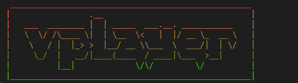
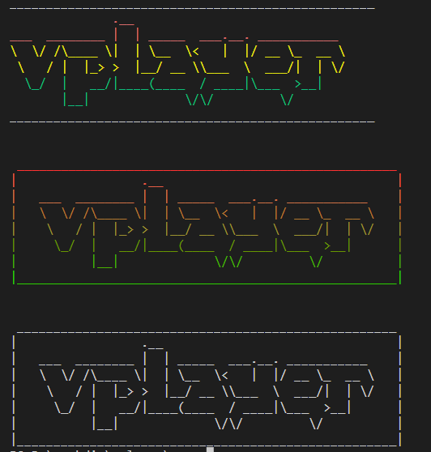

# 使用 C++ 在控制台创建渐变颜色的文本艺术效果

文本艺术是一种通过文本和颜色的组合来创建令人印象深刻的文本图像的艺术形式。在本教程中，我们将使用 C++ 编程语言来创建一个渐变颜色的文本艺术效果，如下所示：
http://patorjk.com/software/taag/#p=display&f=Graffiti&t=vplayer

```
 ____________________________________________________
|                 .__                                |
|   ___  ________ |  | _____  ___.__. ___________    |
|   \  \/ /\____ \|  | \__  \<   |  |/ __ \_  __ \   |
|    \   / |  |_> >  |__/ __ \ \___  \  ___/|  | \/  |
|     \_/  |   __/|____(____  / ____|\___  >__|      |
|          |__|             \/\/         \/          |
|____________________________________________________|
```

在这个例子中，我们将逐行应用颜色渐变效果，从红色到绿色。在这个教程中，你将学到如何使用 ANSI 转义码来设置文本颜色。

## 步骤

让我们一步步来创建这个渐变文本艺术效果：

### 1. 包含头文件

首先，包含必要的头文件：

```cpp
#include <iostream>
#include <stdio.h>
```

### 2. 定义颜色和转义码

我们将定义一些常量来表示颜色和 ANSI 转义码。这些转义码将用于设置文本的颜色。

```cpp
#define ESC "\033"  // ANSI 转义码
#define RESET "\033[0m"  // 重置颜色
```

### 3. 创建主函数

接下来，创建主函数：

```cpp
int main() {
    int step = 30;
    int red, green, blue;
```

### 4. 添加颜色渐变

现在，我们将使用 ANSI 转义码来为每行文本设置颜色渐变。根据你的需求，你可以定义不同的颜色渐变规则。在这个例子中，我们从红色到绿色渐变。

```cpp
    // 第一行
    red = 255;
    green = 0;
    blue = 0;
    printf(ESC "[38;2;%d;%d;%dm", red, green, blue);
    printf(" ____________________________________________________\n");

    // 第二行
    // ...
```

### 5. 重置颜色

最后，不要忘记在文本渐变结束后重置颜色，以确保后续文本不受影响。

```cpp
    printf(RESET); // 重置颜色
```

### 6. 运行代码

保存并编译你的 C++ 代码。然后运行程序，你将看到一个带有颜色渐变的文本艺术效果。

这就是如何使用 C++ 创建渐变颜色的文本艺术效果。你可以根据需要自定义颜色渐变和文本内容来创建各种各样的文本艺术作品。


