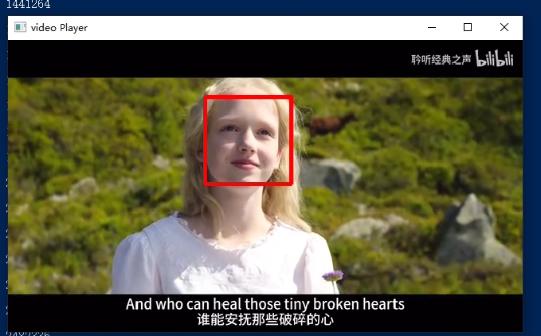

# FFMPEG+SDL简单视频播放器——人脸检测
## 前言
最近突发奇想，给播放器加上一个人脸检测的功能（事情似乎朝着奇怪的方向发展了，谁家的播放器会需要去检测人脸啊😑！），主要的目的是为了学习opencv，尝试将ffmpeg和opencv融合在一起使用。这里着重展示opencv用于人脸检测部分的代码，播放器其余部分可以参考[《FFMPEG+SDL简单视频播放器——视频播放》](https://www.cnblogs.com/Azion/p/17525955.html)和[《FFMPEG+SDL简单视频播放器——视频快进》](https://www.cnblogs.com/Azion/p/17756274.html)

## 实现
### 人脸检测
在之前写的播放器中，视频帧的格式为YUV420。在opencv处理图片前需要进行格式转化，将图片格式从YUV420转化成BGR。如果不进行格式转化，图片被opencv处理后的部分会出现颜色无法正常显示的问题
```cpp
cv::cvtColor(yuvimg, img, COLOR_YUV2BGR_I420);
```
在检测到人脸后，用红框将人脸框起来
```cpp
if (faces.size() > 0)
{
    for (size_t i = 0; i < faces.size(); i++)
    {
        rectangle(img, faces[i], Scalar(0, 0, 255), 3, 8, 0);
    }
}
```
在opencv对图片处理完成后，将处理后的图片进行返回。这里用到了**haarcascade_frontalface_alt2.xml**文件，需要提前下载，或者从opecv的编译目录下复制过来。
完整的人脸检测函数如下
```cpp
cv::Mat detect_face(Mat yuvimg, int64_t times)
{
    cv::Mat img;
    // 转换YUV图像为BGR图像
    cv::cvtColor(yuvimg, img, COLOR_YUV2BGR_I420);
    CascadeClassifier cascade;
    const string path = "./haarcascade_frontalface_alt2.xml";

    // 尝试加载人脸检测器模型
    if (!cascade.load(path))
    {
        // 如果加载失败，返回原始YUV图像
        return yuvimg;
    }
    vector<cv::Rect> faces(0);
    // 使用人脸检测器检测人脸
    cascade.detectMultiScale(img, faces, 1.1, 2, 0, Size(30, 30));
    // 如果检测到人脸
    if (faces.size() > 0)
    {
        // 在图像上绘制检测到的人脸的红色框
        for (size_t i = 0; i < faces.size(); i++)
        {
            rectangle(img, faces[i], Scalar(0, 0, 255), 3, 8, 0);
        }
    }
    else
    {
        // 如果未检测到人脸，返回原始YUV图像
        return yuvimg;
    }
    // 返回处理后的YUV图像
    cv::cvtColor(img, yuvimg, COLOR_BGR2YUV_I420);
    return img;
}
```
### 视频播放
定义一个**Mat**，用于接收视频帧
```cpp
cv::Mat frameMat;
```
在对**AVFrame**的格式进行转换后，将图像数据传递给Mat
```cpp
sws_scale(img_convert_ctx, (const unsigned char *const *)pFrame->data, pFrame->linesize, 0, pCodecCtx->height, pFrameYUV->data, pFrameYUV->linesize);
int64_t pts = packet->pts;
frameMat = cv::Mat(pCodecCtx->height * 3 / 2, pCodecCtx->width, CV_8UC1, pFrameYUV->data[0]);
```
调用**detect_face**函数对视频帧进行人脸检测，得到经过处理后的视频帧
```cpp
frameMat = detect_face(frameMat, pts);
```
将视频帧传递给SDL，通过SDL进行播放
```cpp
SDL_UpdateTexture(sdlTexture, NULL, frameMat.data, frameMat.step);
SDL_RenderClear(sdlRenderer);
SDL_RenderCopy(sdlRenderer, sdlTexture, NULL, &sdlRect_1);
SDL_RenderPresent(sdlRenderer);
```
需要注意的地方是在ffmpeg，opencv和sdl之间进行图像数据的传递时，三者之间的图像数据格式。必要时需要进行图像格式转换，确保图像数据被正确的处理，否则会出现视频无法正常播放或者视频颜色无法正常显示的问题。

播放器的最新完整源码：https://github.com/canaconZion/streaming-practice/tree/main/opencv
> 在windows端编译opencv过程稍微有点繁琐，有空我会写一篇关于在windows端编译opencv源码的blog，帮大家避避坑
### Makefile
```makefile
INC_DIR = ./include
BIN_DIR = ./bin

SRC = face_detect_player.cpp
LIB = -lavutil -lavformat -lavcodec -lavutil -lswscale -lswresample \
    -lSDL2 -llibopencv_core480 -llibopencv_imgcodecs480 -lopencv_highgui480 \
    -lopencv_objdetect480 -lopencv_imgproc480

TARGET = detectPlayer
BIN_TARGET = $(BIN_DIR)/$(TARGET)

CC = g++

$(BIN_TARGET):$(SRC)
	$(CC) $(SRC) -o $(BIN_TARGET) \
		-I$(INC_DIR) \
		$(LIB)

clean:
	rm $(BIN_TARGET).exe
```
### 视频播放效果
