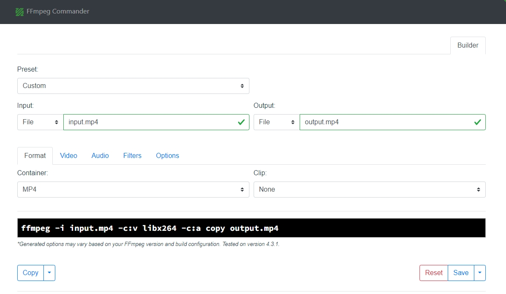

# ffmpeg命令用法总结
## 前言
ffmpeg是开源的媒体处理框架，使用其自带的ffmpeg工具可以很便捷的对媒体文件进行处理。ffmpeg参数很多，通过组合参数可以实现很多功能。下面我将分享一些常用的参数，总结一些经常用到的使用场景。
## 常用参数
```
-i：输入文件
-y：覆盖输出文件
-f：指定输出文件格式
-c：指定编解码器
-c copy 表示音视频保持原有编码
-b：指定比特率
-s：指定分辨率
-r：指定帧率
-t：指定转码时长
-ss：指定转码开始时间
-acodec：指定音频编码器
-vcodec：指定视频编码器
-ac：指定音频通道数
-ar：指定音频采样率
-ab：指定音频比特率
-vn 禁用视频
-an 禁用音频
-map：指定转码流
-metadata：指定输出文件元数据
-threads：指定线程数
-preset：指定编码速度
-crf：指定视频质量
-pix_fmt：指定像素格式
-filter_complex：指定复杂滤镜
-vf：指定简单滤镜
-stream_loop: 指定循环次数
```
## 使用场景
### 1.转协议
使用ffmpeg，可以很轻松的将一种协议的视频流转换成另一种协议。下面举几个例子：
- 将存储在电脑上的视频文件推送为rtmp流
```
ffmpeg -re -stream_loop -1 -i input.mp4 -c:v libx264 -f flv rtmp://server:1935/live/test
```
- 将存储在电脑上的视频文件拉取为rtsp流
```
ffmpeg -re -stream_loop -1 -i input.mp4 -c:v libx264 -f rtsp rtsp://server:8554/live
```
- 将rtsp流转推为rtmp流
```
ffmpeg -i rtsp://server:8554/live -c copy -f flv rtmp://server:1935/live/test
```

### 2.转封装
在工作中，有时可能会遇到需要对视频文件的封装格式进行转换的情况。比如需要将MP4格式的文件转换成MKV，或者将MP4转化成flv。这个时候使用ffmpeg也可以很便捷的实现。例子如下：
- MP4转MKV
```
ffmpeg -i input.mp4 -c copy output.mkv
```
- MP4转flv
```
ffmpeg -i input.mp4 -c copy -f flv output.flv
```

### 3.转编码
使用ffmpeg，可以通过指定编解码器，将一种编码转换成另一种编码。
> 需要注意的是，如果想要进行某个编码格式的转换，需要在编译ffmpeg的时候，将对应的编解码器编译进去。
- 转H264编码
```
ffmpeg -i input.mp4 -c:v libx264 -c:a aac output.mp4
```
- 转H265编码
```
ffmpeg -i input.mp4 -c:v libx265 -c:a aac output.mp4
```
- 转VP9编码
```
ffmpeg -i input.mp4 -c:v vp9 -c:a libvorbis output.webm
```

### 4.音视频裁剪
使用ffmpeg可以实现对视频进行剪切。比如，需要将视频的10~30s的内容剪切出来，可以使用命令：
```
ffmpeg -i input.mp4 -ss 10 -t 10 -c:v copy -c:a copy output.mp4
```
- -ss 10: 指定起始时间，这里是第 10 秒。
- -t 10: 指定持续时间，这里是 10 秒，所以输出文件将包含从第 10 秒到第 20 秒的内容。
### 5.音视频拼接
如果需要将多个视频进行拼接，可以创建一个文本文件，列出要拼接的视频文件的路径。例如，创建一个名为 input.txt 的文本文件，其中包含：

```
file 'video1.mp4'
file 'video2.mp4'
file 'video3.mp4'
```
这表示要拼接的三个视频文件为 video1.mp4、video2.mp4 和 video3.mp4。

使用 ffmpeg 命令进行拼接：
```
ffmpeg -f concat -i input.txt -c copy output.mp4
```
### 6.音视频分离
通过ffmpeg命令，将媒体文件中的音视频分离出来，可以使用如下命令：
- 分离音频，保存为aac文件
```
ffmpeg -i input.mp4 -c:a copy -vn audio.aac
```
- 分离视频，保存为MP4文件
```
ffmpeg -i input.mp4 -c:v copy -an video.mp4
```
### 7.音视频合并
将音频文件和视频文件合并：
```
ffmpeg -i video.mp4 -i audio.aac -c:v copy -c:a copy output.mp4
```
### 8.音视频添加水印
通过ffmpeg，给视频添加水印，可以添加图片水印，也可以添加文字水印。
- 添加图片水印
```
ffmpeg -i input.mp4 -vf "movie=logo.jpg[wm];[in][wm]overlay=30:10[out]" output.mp4
```
- 添加文字水印
```
ffmpeg -i input.mp4 -vf "drawtext=fontsize=100:fontfile=lazy.ttf:text='This is a test':x=20:y=20:fontcolor=green:box=1:boxcolor=yellow" output.mp4
```
- 添加时间水印
```
ffmpeg -re -i input.mp4 -vf "drawtext=fontsize=60:fontfile=lazy.ttf:text='%{localtime\:%Y\-%m\-%d %H-%M-%S}':fontcolor=green:box=1:boxcolor=yellow" output.mp4
```
### 9.音视频加密
关于HLS加密的实现，我专门写过一篇文章。感兴趣的朋友们可以移步[《HLS AES加密》](https://holyzion.host/2023/06/24/HLS-AES%E5%8A%A0%E5%AF%86/)。

### 10.修改视频码率
- 指定码率
```
ffmpeg -i input.mp4 -b:v 1500k output.mp4
```
### 11.修改视频分辨率
```
ffmpeg -i input.mp4 -s 1280x720 output.mp4
```
### 12. 检测视频源是否失效
```
ffmpeg -i <source> -f null -
```
## 补充
除了上述给出的参数外，ffmpeg还有很多参数，如果我们使用命令行对视频进行处理后，没有达到想要的效果，那么就有可能是ffmpeg的参数配置出现了问题，可以参考ffmpeg的[官方文档](https://ffmpeg.org/ffmpeg.html)来获取更多的参数用法。
当有一些特定的需求需要实现，但是又不知道该使用ffmpeg的哪些参数时，可以尝试使用**FFmpeg Commander**工具，你可以根据自己的需求手动选择配置，他可以帮你快速生成ffmpeg的命令行。
链接：https://alfg.dev/ffmpeg-commander/

> 我会持续对文章进行更新，增加更多的ffmpeg命令行的例子。

