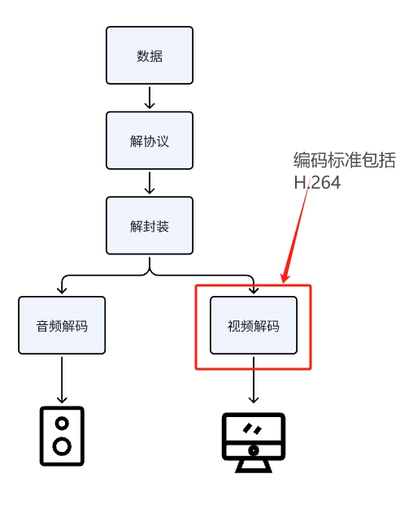

# H.264中的帧
## 导言
高级视频编码 (AVC) 也称为 H.264，是使用最广泛的视频压缩标准。它与所有主要的流式传输协议和容器格式兼容。
当我们使用播放器播放一个视频时，通常会经过：解协议，解封装，音视频解码，音视频同步这几个步骤。其中H.264就是视频解码阶段的标准。通过解封装，可以将数据解析为H.264格式的数据流，通过解码，可以将H.264格式的数据流输出为非压缩的颜色数据，如YUV，RGB等。


## 视频帧
在视频编码中，视频由一系列连续的图像帧组成。每一帧都代表视频中的一个瞬间图像，而它们之间存在特定的关系。为了压缩视频数据的大小，H.264中有三种不同的帧。
### I帧
关键帧是视频序列中的关键参考点，它是独立编码的帧，不依赖于其他帧。
关键帧包含完整的信息，可以独立解码出网站的图像。基于其特性，播放器在进行快进操作时，一般都会跳转到I帧，确保在该关键帧之后的播放过程中可以正常解码和显示视频。这样可以有效减少解码所需的计算量，提高快进操作的响应速度。
### P帧
预测帧是相对于关键帧的帧，它通过对前面的关键帧或预测帧进行预测来编码。
P帧相对于I帧具有较小的文件大小，因为它只存储相对于参考帧的差异信息。但是在进行解码时，P帧也需要依赖之前的帧进行解码。
### B帧
双向预测帧引入了更复杂的预测方式，利用前后的关键帧和预测帧进行双向预测。
相对于关键帧（I 帧）和预测帧（P 帧）具有更高的压缩效率和更复杂的结构，适当的引入B帧可以显著的较小视频文件的大小，提升视频的传输效率。
### 帧解码和播放顺序
由于一个视频文件中可能存在I，B，P三种不同的视频帧，所以帧的解码和播放顺序可能会不同。在H.264中，有两个时间戳，一个是PTS，一个是DTS：
- PTS（Presentation Time Stamp）：
    - PTS 表示视频帧应该被展示的时间。它指示视频帧何时应该在播放器中显示给用户。
    - PTS 的时间单位通常是毫秒（ms）或时钟周期，取决于具体的应用和实现。
    - PTS 的值不仅受到帧自身的编码时间影响，还受到解码和显示的延迟等因素的影响。
- DTS（Decoding Time Stamp）：
    - DTS 表示视频帧应该被解码的时间。它指示视频帧何时应该被送入解码器进行解码。
    - 与 PTS 不同，DTS 主要关注解码过程，而不是展示过程。
    - 在一些情况下，视频帧的 DTS 可能等于其 PTS，但在其他情况下可能存在差异，这取决于编码和解码过程中的各种因素。

在视频中没有B帧时，视频的解码顺序和播放顺序如下：
```
Stream: I P P P P P P 
   PTS: 1 2 3 4 5 6 7
   DTS: 1 2 3 4 5 6 7
```
在视频中存在B帧时，视频的解码顺序和播放顺序如下：
```
Stream: I B B P B B P
   PTS: 1 2 3 4 5 6 7
   DTS: 1 3 4 2 6 7 5
```
## GOP
全称是Group of Pictures，即画面组，是一组连续的画面。
一个GOP由一系列图像帧组成，这些图像帧通常都是I帧，或者P帧，或者B帧。GOP的长度就是两个I帧之间的距离。
在视频编码中，GOP（Group of Pictures）的结构通常用"M"和"N"来表示：
- M帧（IPredictive周期）：表示在两个I帧（包括第一个I帧）之间的帧数，即P帧和B帧的总数。M帧的设定影响着两个I帧之间的编码周期长度。
- N帧（GOP周期）：表示两个连续I帧之间的总帧数，包括M帧、I帧以及I帧之间的所有帧。N帧定义了一个GOP的长度。

例如
```
IBBPBBPBBPBB
```
其中M=2，N=12。这表示两个I帧之间有10帧，其中包含了2个P帧和8个B帧。这样的结构有助于提高视频编码的压缩效率和压缩质量。

## IDR

I帧和IDR帧都是H.264视频编码中的关键帧，所有的 IDR 帧都是 I 帧，但是并不是所有 I 帧都是 IDR 帧。
IDR帧在一些方面和I帧有一些区别。
- IDR帧也是关键帧，但有一个重要的特性是它可以用来随时刷新解码器的状态。
- 当解码器在解码过程中发生错误或需要进行随机访问时，通常会使用IDR帧来重新开始解码。
- IDR帧之后的帧不可以参考之前的帧。
总体而言，IDR帧可以看作是一种特殊类型的I帧，具有附加的刷新解码器状态的功能。在需要在任何时间点重新开始解码时，IDR帧是很有用的。