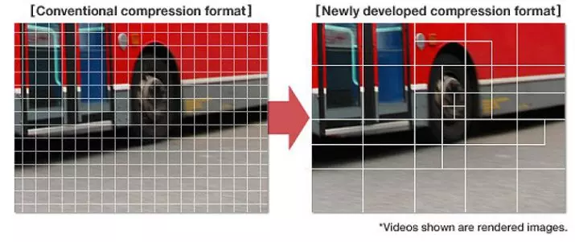
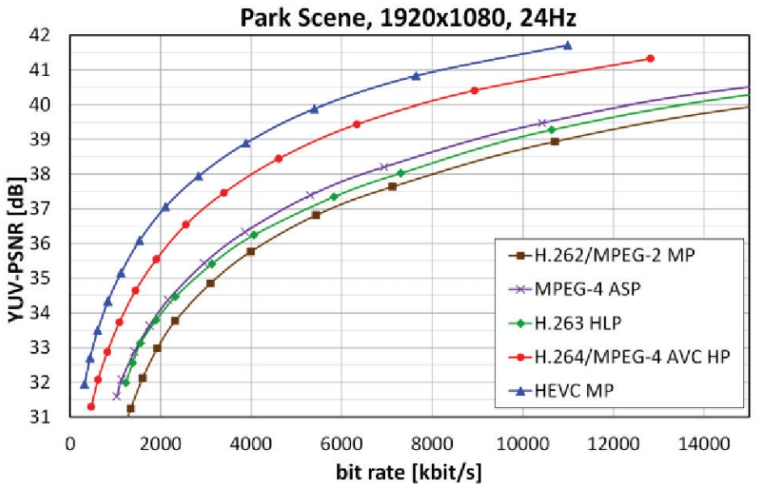
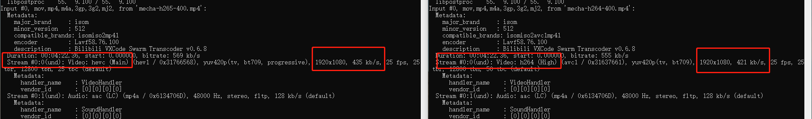
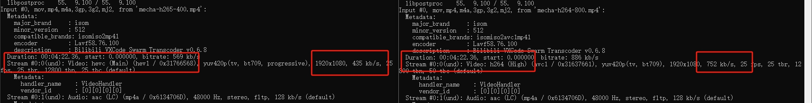
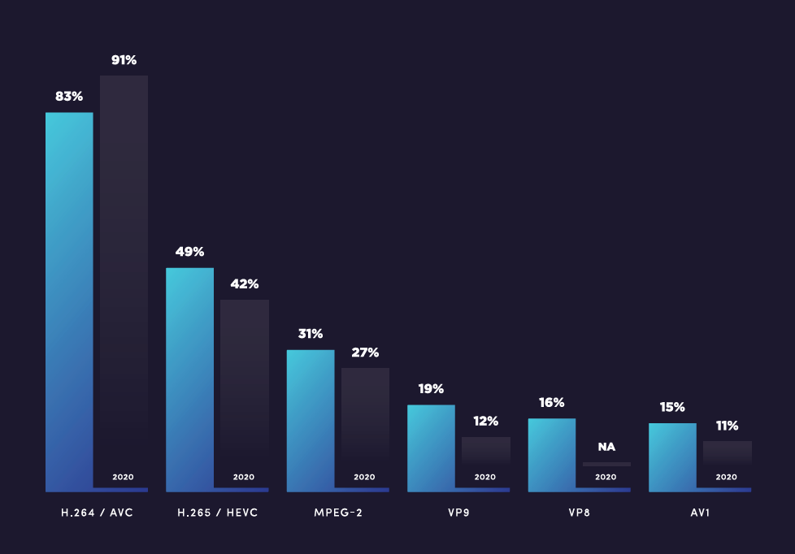

# H.264 和 H.265对比
## 前言
H.264标准正式发布于2003年3月，距今已经20多年了，但它仍然是当下最流行的视频编解码标准。
H.265正式发布于2013年4月。虽然H.265标准是围绕着H.264进行制定的，也保留了原来的一些技术，但是在提升压缩率，改善码流质量，降低延时等方面使用了更为先进的技术。
下面我将从编码原理，实际的效果等部分方面对H.264和H.265进行一些比较。
## H.264 和 H.265对比
视频本身存在着大量的数据冗余，包括时间冗余，空间冗余，视觉冗余等。所以通过减少冗余，可以有效的降低数据量，实现视频的压缩。视频压缩编码采用预测编码、变换编码和熵编码等技术来降低视频中的冗余数据。在处理数据冗余方面，H.265采用了比H.264更为复杂的技术和算法。
### 分块
H.265比H.264采用了更先进、更灵活的编码单元。
H.264标准将每个视频帧分解成宏块，H.264的每个宏块大小都是固定的，最大为16x16像素。
H.265使用编码树单元，根据区域信息量来决定编码单元的大小，它们的大小和形状不一定相同，从最小的8x8像素到最大的64x64像素。

### 帧内预测
H.264的帧内预测有9种模式，而H.265的帧内预测多达35种模式。
更多的帧内预测模式意味着编码器有更多的选项来分析和利用图像中的空间相关性。帧内预测可以利用这种相似性，减少帧内的冗余信息。所以H.265可以拥有比H.264更高的压缩率。
### 帧间预测
H.264主要使用基于运动矢量的帧间预测。它通过在帧间寻找相似区域，然后使用运动矢量来描述这些区域的运动情况。
由于H.265引入了更多的帧内预测模式，允许更好地捕捉图像中的空间相关性，所以可以进行更复杂的帧间预测，以进一步消除图像的时间冗余，提高压缩率。
### 传输码率
得益于更复杂先进的技术和算法，画面质量相同的情况下，H.265的数据量比H.264的更小。
<!-- [图源](http://www.img.lx.it.pt/~fp/cav/Additional_material/HEVC-Performance.pdf) -->

### 最大分辨率
- H.264: 4K (4092x2160)
- H.265: 8K UHD (8192x4320)
### 画面质量
从下面的对比图中可以很直观的看出，在码率相近的情况下，H.265的画面质量明显要比H.264更好。当H.265码率为H.264的50%时左右时，画面质量才比较接近。
- H.265 400kbps vs H.264 400kbps

- H.265 400kbps vs H.264 750kbps

### 使用率
[《Bitmovin’s 2021 Video Developer Report》](https://go.bitmovin.com/video-developer-report-2021)中展示了各个编码器使用率的统计结果。
2021年H.264编码器的使用率为83%，虽然同比低于2020年的91%，但是在一众的编码器中仍然处于第一的位置。
2021年H265编码器的使用率为49%，较2020年有所上升。但是和H.264仍然存在着一定的差距。

从统计图中可以看出，时至今日，H.264仍然是使用最广泛，最流行的视频压缩技术。
## 总结
得益于更复杂先进的技术和算法，H.265能够提供比H.264更高的画面质量和压缩率。这就意味H.265能够在提供给用户更好的视觉体验的同时，降低网络传输的成本。这使其在4K、8K等高清场景下更具优势。
但是由于其更加复杂的算法，在对视频进行编解码时，也需要更高的算力，这也就意味着更高的硬件成本。这也导致目前除了特定领域，H.265的普及度和兼容性远不及H.264。
不过随着时间的推移，当硬件成本的下降，算力的提升，能够兼容H.265的设备和标准一定会越来越多，H.265的普及度也会逐渐上升。