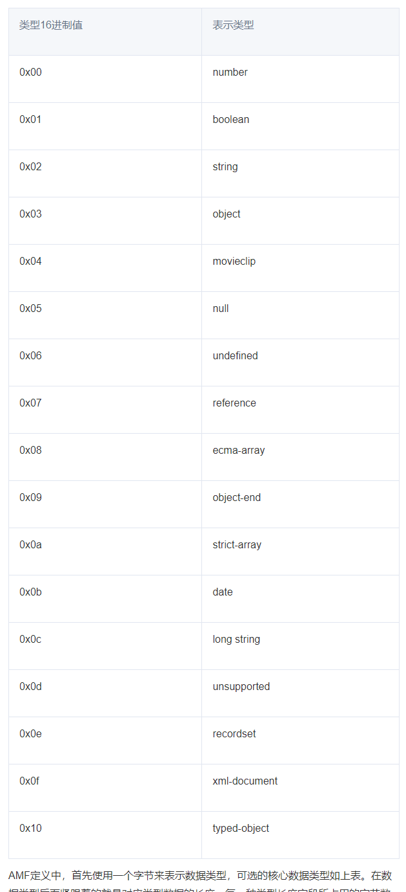

- tcp三次握手
- rtmp三次握手
- connect c->s
    连接成功，服务端向客户端发送_result消息，否则发送_error消息
    

----------------------------

- chunk stream id 
    
- rtmp header
    
- rtmp body
AMF英文全称Action Message Format
RTMP数据包的序列化就是按照AMF0的格式进行
    