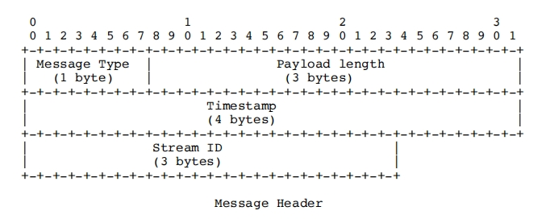
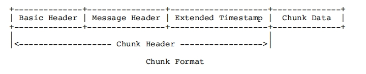
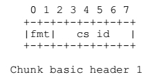
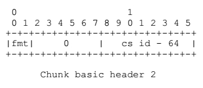
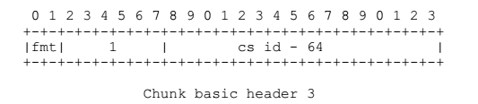

# RTMP协议学习——Message与Chunk解读
## 前言
之前通过对抓包数据的学习和分析，对RTMP协议有了一个整体的认知，大致了解了RTMP从建立连接到播放视频的流程,文章请看[《RTMP协议学习——从握手到播放》](https://holyzion.host/2023/11/10/RTMP%E5%8D%8F%E8%AE%AE%E5%AD%A6%E4%B9%A0%E2%80%94%E2%80%94%E4%BB%8E%E6%8F%A1%E6%89%8B%E5%88%B0%E6%92%AD%E6%94%BE/)。但是对于RTMP消息传输的载体还没有过多的分析。本文将会就RTMP的传输数据方面，对RTMP协议进行进一步的研究和学习。
## Message
Message是RTMP协议中的基本数据单元。消息可以包含音频，视频，控制消息，以及其它数据。
### Message的格式
RTMP的消息由两部分构成，分别是header和payload。
#### Header

- Message Type (消息类型)：一个字节的字段来表示消息类型。类型 ID 1 - 6 被保留用于协议控制消息。

- Length (长度)：三个字节的字段来表示有效负载的字节数。以大端格式保存。

- Timestamp：四个字节的字段包含了当前消息的 timestamp。四个字节也以大端格式保存。以毫秒为单位，时间戳用于同步音视频播放以及计算延迟。

- Message Stream Id (消息流 ID)：三个字节的字段以指示出当前消息的流。这三个字节以大端格式保存。
#### Payload
payload中是这个消息所包含的实际内容，一般是音频或者视频等信息。
## Chunk
消息是通过消息块（Chunk）进行分块传输的。Chunk 是 RTMP 传输的基本单位，用于将消息拆分成小块进行传输。
将Message拆成Chunk进行传输有以下几个原因：
- 流控制： 拆分成 Chunk 可以更好地进行流控制。通过将消息拆分成小块，可以根据网络状况和接收方的处理能力来调整 Chunk 的大小。这有助于防止网络拥塞和提高整体性能。

- 实时传输： RTMP 主要应用在实时传输场景，如音视频直播。拆分成 Chunk 允许更快地将部分消息传输到接收方，从而降低整体的延迟。

- 灵活性： 拆分成 Chunk 提供了更大的灵活性，允许在传输中插入其他消息或进行其他控制。这对于复杂的实时通信协议来说是非常重要的。

- 错误恢复： 如果发生传输错误，仅仅需要重新传输丢失或损坏的 Chunk，而不需要重新传输整个消息。这提高了系统的容错性。

- 封装协议的设计： RTMP 使用 Chunk 进行消息的封装，这种设计可以更好地适应不同的应用场景和网络环境。
### Chunk的格式
每个chunk由header和chunk data组成，如下图所示：

#### Chunk Header
##### Basic Header
Basic Header对块流 ID 和块类型进行编码。
其中Basic Header的第一个字节的前两位为块类型（fmt）。块类型一共有四种，决定了Message Header的类型选择。
块基本头字段可能会有 1，2 或者 3 个字节，取决于块流 ID，对应关系如下表：
|块流 ID|字节|格式|
|:-------:|:--------:|:------:|
|2 - 63|1||
|64 - 319|2||
|64 - 65599|3||
##### Message Header
块消息头有四种不同的格式，由Basic Header中的块类型进行选择。
##### Extended Timestamp
#### Chunk Data
## 参考链接
https://rtmp.veriskope.com/pdf/rtmp_specification_1.0.pdf