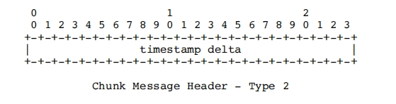

# RTMP协议学习——Message与Chunk解读
## 前言
之前通过对抓包数据的学习和分析，对RTMP协议有了一个整体的认知，大致了解了RTMP从建立连接到播放视频的流程,文章请看[《RTMP协议学习——从握手到播放》](https://holyzion.host/2023/11/10/RTMP%E5%8D%8F%E8%AE%AE%E5%AD%A6%E4%B9%A0%E2%80%94%E2%80%94%E4%BB%8E%E6%8F%A1%E6%89%8B%E5%88%B0%E6%92%AD%E6%94%BE/)。但是对于RTMP消息传输的载体还没有过多的分析。本文将会就RTMP的传输数据方面，对RTMP协议进行进一步的研究和学习。
## Message
Message是RTMP协议中的基本数据单元。消息可以包含音频，视频，控制消息，以及其它数据。
### Message的格式
RTMP的消息由两部分构成，分别是header和payload。
#### Header

- Message Type (消息类型)：一个字节的字段来表示消息类型。类型 ID 1 - 6 被保留用于协议控制消息。

- Length (长度)：三个字节的字段来表示有效负载的字节数。以大端格式保存。

- Timestamp：四个字节的字段包含了当前消息的 timestamp。四个字节也以大端格式保存。以毫秒为单位，时间戳用于同步音视频播放以及计算延迟。

- Message Stream Id (消息流 ID)：三个字节的字段以指示出当前消息的流。这三个字节以大端格式保存。
#### Payload
payload中是这个消息所包含的实际内容，一般是音频或者视频等信息。
## Chunk
消息是通过消息块（Chunk）进行分块传输的。Chunk 是 RTMP 传输的基本单位，用于将消息拆分成小块进行传输。创建的每个块都有一个唯一 ID 对其进行关联，这个 ID 叫做 chunk stream ID。
将Message拆成Chunk进行传输有以下几个原因：
- 流控制： 拆分成 Chunk 可以更好地进行流控制。通过将消息拆分成小块，可以根据网络状况和接收方的处理能力来调整 Chunk 的大小。这有助于防止网络拥塞和提高整体性能。

- 实时传输： RTMP 主要应用在实时传输场景，如音视频直播。拆分成 Chunk 允许更快地将部分消息传输到接收方，从而降低整体的延迟。

- 灵活性： 拆分成 Chunk 提供了更大的灵活性，允许在传输中插入其他消息或进行其他控制。这对于复杂的实时通信协议来说是非常重要的。

- 错误恢复： 如果发生传输错误，仅仅需要重新传输丢失或损坏的 Chunk，而不需要重新传输整个消息。这提高了系统的容错性。

- 封装协议的设计： RTMP 使用 Chunk 进行消息的封装，这种设计可以更好地适应不同的应用场景和网络环境。
### Chunk的格式
每个chunk由header和chunk data组成，如下图所示：

#### Chunk Header
##### Basic Header
Basic Header对块流 ID 和块类型进行编码。
其中Basic Header的第一个字节的前两位为块类型（fmt）。块类型一共有四种，决定了Message Header的类型选择。
块基本头字段可能会有 1，2 或者 3 个字节，取决于chunk stream ID，对应关系如下表：
|块流 ID|字节数|格式|
|:-------:|:--------:|:------:|
|2 - 63|1||
|64 - 319|2||
|64 - 65599|3||
##### Message Header
块消息头有四种不同的格式，由Basic Header中的块类型进行选择。
|类型|字节数|格式|
|:---:|:----:|:----:|
|0|11||
|1|7||
|2|3||
|3|0|无|
- Type0
    - 用于块流的开始和时间戳后退的情况下。
    - timestamp最大为16777215，即2²⁴-1。
- Type1
    - 不包含message stream id
    - 这一块使用前一块一样的流 ID。可变长度消息的流 (例如，一些视频格式) 应该在第一块之后使用这一格式表示之后的每个新消息。
- Type2
    -  不包含stream ID和message length。
    - 具有和前一块相同的流 ID 和消息长度。具有不变长度的消息 (例如，一些音频和数据格式) 应该在第一块之后使用这一格式表示之后的每个新消息。
- Type3
    - 没有消息头。流 ID、消息长度以及 timestamp delta 等字段都不存在。
    - 使用前面块一样的块流 ID。
    - 当单一一个消息被分割为多块时，除了第一块的其他块都应该使用这种类型。
##### Extended Timestamp
用于对大于 16777215的 timestamp 或者 timestamp delta 进行编码。可以通过设置类型 0 块的 timestamp 字段、类型 1 或者 2 块的 timestamp delta 字段 16777215 (0xFFFFFF) 来启用这一字段。当最近的具有同一块流的类型 0、1 或 2 块指示扩展extended timestamp 字段出现时，这一字段才会在类型为 3 的块中出现。
这样设计的目的是在满足大多数情况下使用更紧凑的数据表示，而只在必要时才使用额外的字节。
#### Chunk Data
当前块的有效负载，相当于定义的最大块大小。
## Message类型
### 命令消息 (20, 17)
命令消息在客户端和服务器之间携带AMF编码的命令。这些消息的AMF0编码的消息类型值为20，AMF3编码的消息类型值为17。发送这些消息来执行一些操作，如连接、创建流、发布、播放、暂停对等点。命令消息，如在线状态，结果等。用于通知发件人所请求的命令的状态。命令消息由命令名称、事务ID和包含相关参数的命令对象组成。客户端或服务器可以通过使用命令消息向对等点进行通信的流来请求远程过程调用（RPC）。
### 数据消息 (18, 15)
客户端或服务器发送此消息以发送元数据或任何用户数据到对等数据。元数据包括有关数据的详细信息（音频、视频等）。比如创作时间，持续时间，主题等等。AMF0的消息类型值为18，AMF3的消息类型值为15。
### 共享对象消息 (19, 16)
共享对象是一个Flash对象（名称值对的集合），它在多个客户端、实例等之间进行同步。AMF0的消息类型19和AMF3的消息类型16为共享对象事件保留。每个消息都可以包含多个事件。

支持以下事件类型：
|事件|描述|
|:----|:----|
|Use (=1)|客户端发送此事件以通知服务器关于已命名共享对象的创建|
|Release (=2)|当在客户端删除共享对象时，客户端将此事件发送给服务器。|
|Request Change (=3)|客户端发送此事件以请求更改与共享对象的命名参数关联的值|
|Change (=4)|服务器发送此事件以通知所有客户端(发出请求的客户端除外)指定参数值的更改。|
|Success (=5)|如果请求被接受，服务器将发送此事件给请求客户机作为RequestChange事件的响应。|
|SendMessage (=6)|客户端将此事件发送到服务器以广播消息。在接收到此事件时，服务器向所有客户机广播一条消息，包括发送方。|
|Status (=7)|服务器发送此事件以通知客户端有关错误情况。|
|Clear (=8)|服务器向客户端发送此事件以清除共享对象。服务器还发送此事件以响应客户端在连接时发送的Use事件。|
|Remove (=9)|服务器发送此事件以让客户端删除插槽。|
|Requese Remove (=10)|客户端发送此事件以使客户端删除槽。|
|Use Success (=11)|在连接成功时，服务器将此事件发送给客户端。|
### 音频消息 (8)
客户端或服务器发送此消息向音频数据发送到对等点。消息类型值8将保留给音频消息。
### 视频消息 (9)
客户端或服务器发送此消息以向对等点发送视频数据。消息类型值9将保留给视频消息。
### 聚合消息 (22)
聚合消息是包含一系列RTMP子消息。消息类型22用于聚合消息。


聚合消息的消息流ID将覆盖聚合内部的子消息的消息流ID。聚合消息和第一个子消息的时间戳之间的差异是用于将子消息的时间戳重新规格化到流时间尺度的偏移量。该偏移量被添加到每个子消息的时间戳中，以到达规范化的流时间。第一个子消息的时间戳应该与聚合消息的时间戳相同，因此偏移量应该为零。返回的指针包含前一条消息的大小，包括它的报头。它被包括来匹配FLV文件的格式，并用于向后查找。
使用聚合消息有几个性能好处：
- 块流最多可以在一个块中发送一条完整的消息。因此，增加块的大小并使用聚合消息可以减少发送的块的数量。
- 子消息可以连续地存储在内存中。当进行系统调用以在网络上发送数据时，其效率更高
### 用户控制消息事件
客户端或服务器发送此消息以通知对等点有关用户控制事件。
支持以下用户控制事件类型：
|事件|描述|
|:----|:----|
|Stream Begin (=0)|服务器发送此事件以通知客户端流已变得可用并可用于通信。 默认情况下，成功从客户端接收到应用程序连接命令后，此事件在 ID 0 上发送。 事件数据是 4 字节，表示开始运行的流的流 ID。|
|Stream EOF (=1)|服务器发送此事件以通知客户端该流上的数据播放已按请求结束。 如果不发出附加命令，则不会发送更多数据。 客户端丢弃为流接收的消息。 事件数据的 4 个字节表示播放已结束的流的 ID。|
|StreamDry (=2)|服务器发送此事件以通知客户端流上没有更多数据。 如果服务器在一段时间内没有检测到任何消息，它可以通知订阅的客户端流已干。 4个字节的事件数据代表干流的流ID。|
|SetBuffer Length (=3)|客户端发送此事件以通知服务器用于缓冲流中传入的任何数据的缓冲区大小（以毫秒为单位）。此事件在服务器开始处理流之前发送。 事件数据的前 4 个字节表示流 ID，接下来的 4 个字节表示缓冲区长度（以毫秒为单位）。|
|StreamIs Recorded (=4)|服务器发送此事件以通知客户端该流是录制流。 4 字节事件数据代表录制流的流 ID。|
|PingRequest (=6)|服务器发送此事件来测试客户端是否可达。 事件数据是一个 4 字节时间戳，表示服务器发送命令时的本地服务器时间。客户端在收到 MsgPingRequest 后以 PingResponse 进行响应。|
|PingResponse (=7)|客户端将此事件发送到服务器以响应 ping 请求。 事件数据是 4 字节时间戳，随 Ping Request 请求一起接收。|
## 总结

在 RTMP（Real-Time Messaging Protocol）中，消息（message）和分块（chunk）是两个重要的概念。
- 消息（Message）： RTMP 的通信单元被称为消息。消息包含了一些元数据以及实际的音视频数据。这些消息可以分为音频消息、视频消息、命令消息等，具体的消息类型由消息头中的消息类型字段指定。
- 分块（Chunk）： RTMP 使用分块的方式将消息拆分成更小的数据块。分块主要是为了支持实时性，将大的消息拆分成小的块，可以更快地传输，响应时间更短。每个分块都有自己的消息头，其中包含了块的长度、消息类型等信息。在一个 RTMP 连接中，可以有多个消息流，每个消息流有自己的 ID。
分块的基本结构如下：
    - Basic Header（基本头）： 用于指示分块的格式和长度。
    - Message Header（消息头）： 包含消息的时间戳、消息长度等信息。
    - Extended Timestamp（扩展时间戳）： 当消息头中的时间戳字段无法满足表示实际时间戳时，使用扩展时间戳字段。
这样的设计使得 RTMP 能够在不同的网络条件下，提供较好的实时性和流畅性。

总的来说，消息是 RTMP 通信的逻辑单元，而分块是为了提高实时性而采取的物理拆分手段。
----- --------
**参考链接**

https://rtmp.veriskope.com/pdf/rtmp_specification_1.0.pdf
<!-- ```
 0 1 2 3 4 5 6 7
+-+-+-+-+-+-+-+-+
|fmt| cs id     |
+-+-+-+-+-+-+-+-+
``` -->