# RTMP协议学习——从握手到播放
从客户端发起播放请求，到rtrmp视频流开始播放，大致经过了`握手->建立连接->创建流->播放`这几步比较重要的步骤。下面我将结合wireshark的抓包，对其中的每个流程进行分析和学习。
## 握手
RTMP协议基于TCP，TCP建立连接有三次握手。在TCP连接建立以后，会再进行一次RTMP协议层次的握手。
### TCP握手
TCP建立连接的三次握手如图所示：
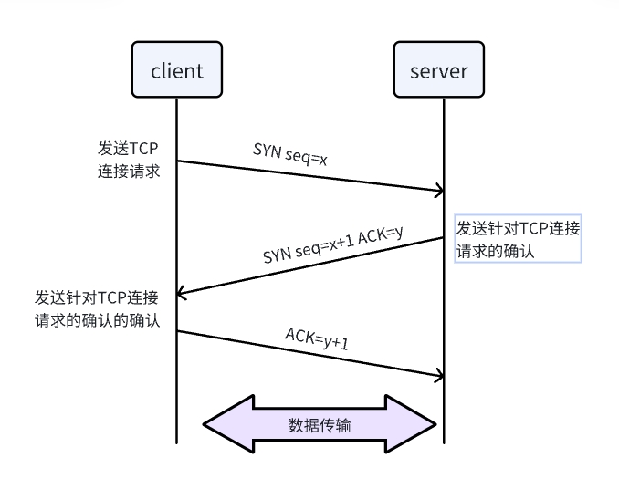
从wireshark的抓包中，也可以看到TCP的三次握手。
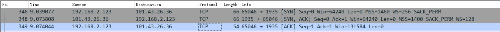

### RTMP握手
在TCP建立连接成功后，rtmp会再进行三次握手。
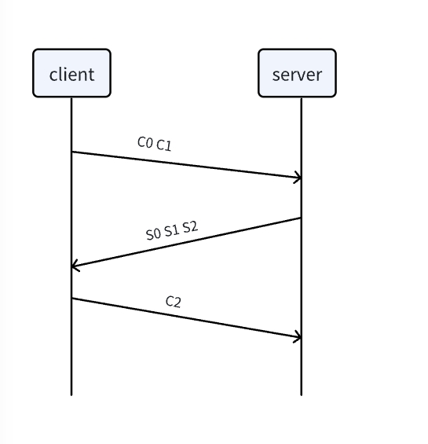
可以通过在wireshark的过滤器中输入rtmpt来过滤RTMP协议的数据，如图所示：

客户端首先发送C0、C1到服务器。其中C1的大小是固定的，为1536个字节。服务端收到C0，C1后，发送S0，S1给客户端，S1的大小和C1一样，为1536个字节。服务端收齐C0，C1后，发送S2给客户端，客户端收齐S0，S1后，发送C2给服务端。C2和S2的大小也为1536个字节。可以看出来，rtmp协议握手交换数据报文的大小是固定的。
下图是引自wiki，可以很清晰的看到客户端和服务端的交互流程和包之间的关系：
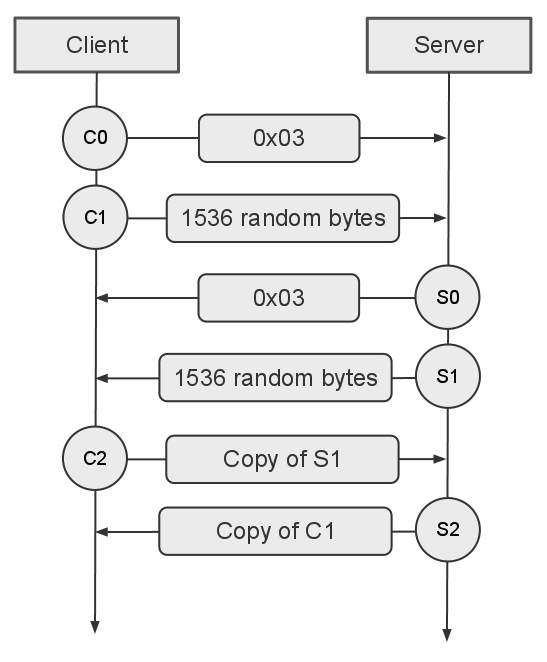
#### C0 and S0
C0和S0都是单一的八位字节，里面包含着客户端要求的RTMP版本号
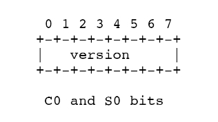
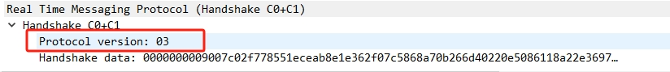
#### C1 and S1
C1和S1的长度都是1536个字节，里面包含着时间戳，4个字节的0和1528个字节随机生成的数据
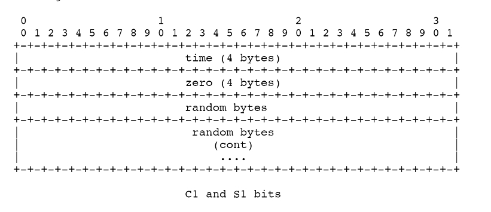
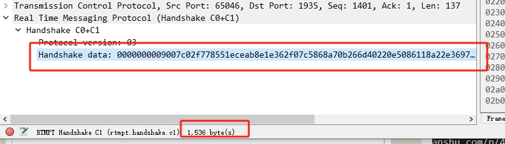
#### C2 and S2
C2和S2的长度是1536个字节，其中的数据包括：
- time：终端在 S1 (给 C2) 或者 C1 (给 S2) 发的 timestamp。
- time2：终端先前发出数据包 (S1 或者 C1) timestamp。
- random echo：终端发的 S1 (给 C2) 或者 S2 (给 C1) 的随机数据。
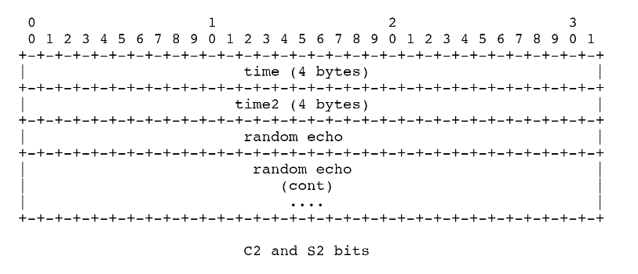
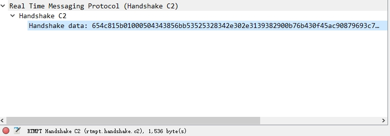

## connect
### 客户端
握手完成后，客户端会发送connect命令到服务端，请求连接一个服务器应用的实例。
connect消息组成如下：
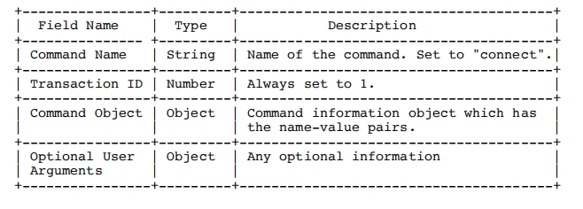
其中**Command Object**包含了多个字段，来帮助客户端和服务端的连接。
Command Object包含的字段如下：
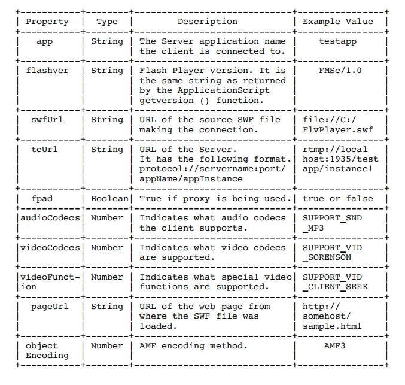
- app：客户端连接到服务器应用端的名字
- flashver：Flash Player 版本号。和ApplicationScript getversion() 方法返回的是同一个字符串。
- swfUrl：进行当前连接的 SWF 文件源地址。
- tcUrl：服务器 URL。
- fpad：代理标志，如果使用了代理就是 true。
- audioCodecs：表明客户端所支持的音频编码。
- videoCodecs：表明支持的视频编码。
- videoFunction：表明所支持的特殊视频方法。
- pageUrl：SWF 文件所加载的网页 URL。
- objectEncoding：AMF 编码方法。

总的来说，就是包含了版本，流名称，url，音视频编码等后面播放视频流时所用的信息，以保证后续服务端发送的视频数据可以正常播放。
wireshark抓包如下：
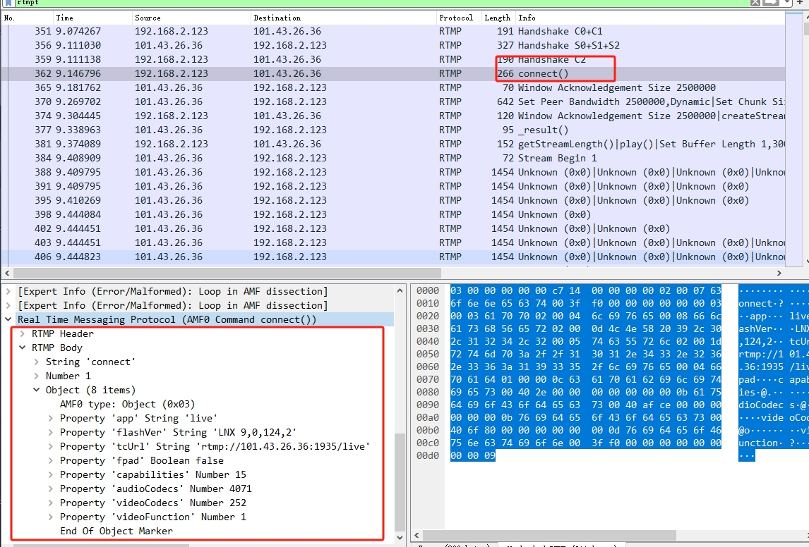
### 服务端
服务端收到connect命令后，发送了几条消息给客户端。如下图所示：
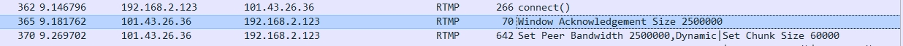
#### Window Acknowledgement size
Window Acknowledgement size的结构如下：
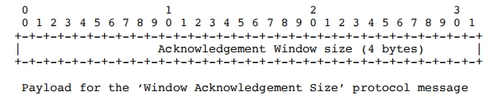
**Window Acknowledgement size**是服务器端用来通知对端发送和应答之间窗口大小的。
此例子中发送的窗口大小为2500000。
#### Set Peer Bandwidth
该消息里限制对端输出带宽。
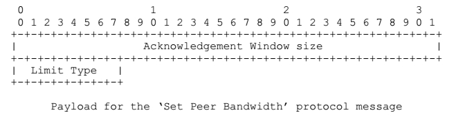
限制类型取以下值之一：

- 0 - Hard：对端应该限制其输出带宽到指示的窗口大小。

- 1 - Soft：对端应该限制其输出带宽到知识的窗口大小，或者已经有限制在其作用的话就取两者之间的较小值。

- 2 - Dynamic：如果先前的限制类型为 Hard，处理这个消息就好像它被标记为 Hard，否则的话忽略这个消息。
  
#### Set Chunk Size
设置块大小，以通知对端新的最大块大小，默认为128字节。
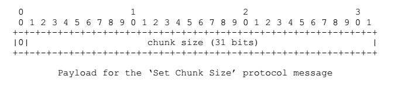
> Chunk是消息的一段。消息在网络发送之前被拆分成很多小的部分。Chunk可以确保端到端交付所有消息有序 timestamp，即使有很多不同的流。Chunk的格式如下：
> 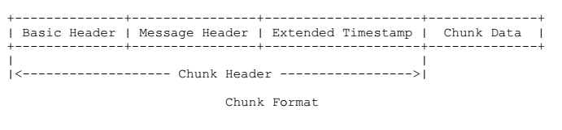
## createStream
在connect完成后就可以创建或者访问RTMP流了。
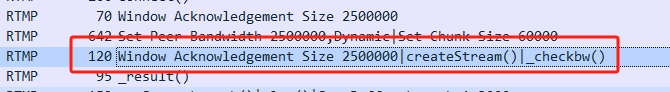
从抓包数据可以看到，服务端向客户端发送了三条命令，分别是**Window Acknowledgement size**，**createStream**和_**checkbw**。
- Window Acknowledgement size是对之前服务端发送的Set Peer Bandwidth消息的应答。
- _checkbw用于检查带宽，来评估与服务器的连接质量和带宽。

主要的消息是**creatStream**，客户端发送此消息到服务端，创建一个逻辑通道，用于消息通信。音频、视频、元数据均通过createStream创建的数据通道进行交互。createStream消息的结构如下：
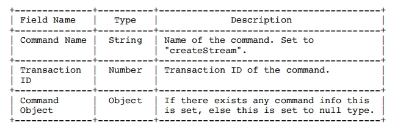
客户端发送createStream请求之后，服务端会反馈一个结果给客户端，如果成功，则返回_result，如果失败，则返回_error。
wireshark抓包数据如下：
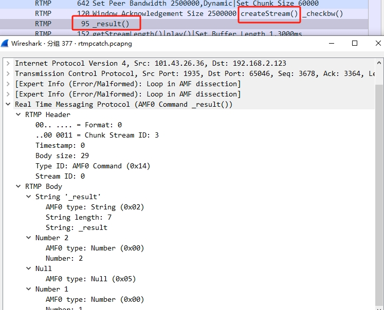
在服务端返回的数据中，最后一个字段为Stream ID，作为该Stream的唯一标识。此例子中返回的是1，后续的视频或音频的Stream ID就是1。
至此，客户端和服务端的通道已经建立完成，接下来就可以进行数据的传输了。
## play
createStream成功后，客户端发送play命令，通知服务端开始播放视频流。
play消息有7个字段，其中最后3个为可选字段。
- Command Name: String类型，命令的名称，为“play”。
- Transaction ID: Number类型，事务ID。
- - Command Object：命令信息不存在。设为 null 类型。
- Stream Name: String类型，要播放流的名字。
- Start(可选): Number类型，以秒为单位定义开始时间，默认值为 -2，表示用户首先尝试播放流名字段中定义的直播流。
- Duration(可选): Number类型，以秒为单位定义了回放的持续时间。默认值为 -1。-1 值意味着一个直播流会一直播放直到它不再可用或者一个录制流一直播放直到结束。
- Reset(可选): Boolean类型，定义了是否对以前的播放列表进行 flush。
wireshark抓包数据为：
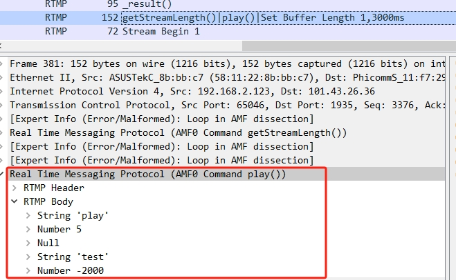
从抓包数据可以看到，此次事务ID为5；流的名称为“test”；start为-2000ms，即-2s，用户首先尝试播放流名字段中定义的直播流。

客户端发送play命令来播放指定流后，就开始传输音视频数据。后面就是客户端按照流程对接收到的数据进行解协议，解封装，解码..........
........此处省略一万字...........