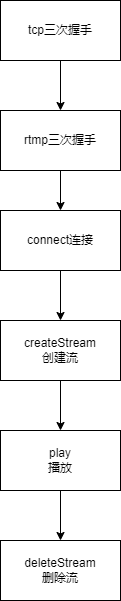

# rtmp
## rtmp播放流程

从客户端发起播放请求，到播放结束，大致经过了`握手->建立连接->创建流->播放->删除流`这几步比较重要的流程。下面我将结合wireshark的抓包，对其中的每个流程进行分析和学习。
## 握手
RTMP协议基于TCP，TCP建立连接有三次握手。在TCP连接建立以后，会再进行一次RTMP协议层次的握手。
### TCP握手
TCP建立连接的三次握手如图所示：

从wireshark的抓包中，也可以看到TCP的三次握手。

### RTMP握手
在TCP建立连接成功后，rtmp会再进行三次握手。

可以通过在wireshark的过滤器中输入rtmpt来过滤RTMP协议的数据，如图所示：

客户端首先发送C0、C1到服务器。其中C1的大小是固定的，为1536个字节。服务端收到C0,C1后，发送S0,S1给客户端，S1的大小和C1一样，为1536个字节。服务端收齐C0,C1后，发送S2给客户端，客户端收齐S0,S1后，发送C2给服务端。C2和S2的大小也为1536个字节。可以看出来，rtmp协议握手交换数据报文的大小是固定的。
下图是引自wiki，可以很清晰的看到客户端和服务端的交互流程和包之间的关系：

#### C0 and S0
C0和S0都是单一的八位字节，里面包含着客户端要求的RTMP版本号

#### C1 and S1
C1和S1的长度都是1536个字节，里面包含着时间戳,4个字节的0和1528个字节随机生成的数据

#### C2 and S2
C2和S2的长度是1536个字节，其中的数据包括：
- time：终端在 S1 (给 C2) 或者 C1 (给 S2) 发的 timestamp。
- time1：终端先前发出数据包 (S1 或者 C1) timestamp。
- random echo：终端发的 S1 (给 C2) 或者 S2 (给 C1) 的随机数据。

## connect
握手完成后，客户端会发送connect命令到服务端，请求连接一个服务器应用的实例。
connect消息组成如下：

其中**Command Object**包含了多个字段，来帮助客户端和服务端的连接。
Command Object包含的字段如下：

- app：客户端连接到服务器应用端的名字
- flashver：Flash Player 版本号。和ApplicationScript getversion() 方法返回的是同一个字符串。
- swfUrl：进行当前连接的 SWF 文件源地址。
- tcUrl：服务器 URL。
- fpad：代理标志，如果使用了代理就是 true。
- audioCodecs：表明客户端所支持的音频编码。
- videoCodecs：表明支持的视频编码。
- videoFunction：表明所支持的特殊视频方法。
- pageUrl：SWF 文件所加载的网页 URL。
- objectEncoding：AMF 编码方法。

wireshark抓包如下：
