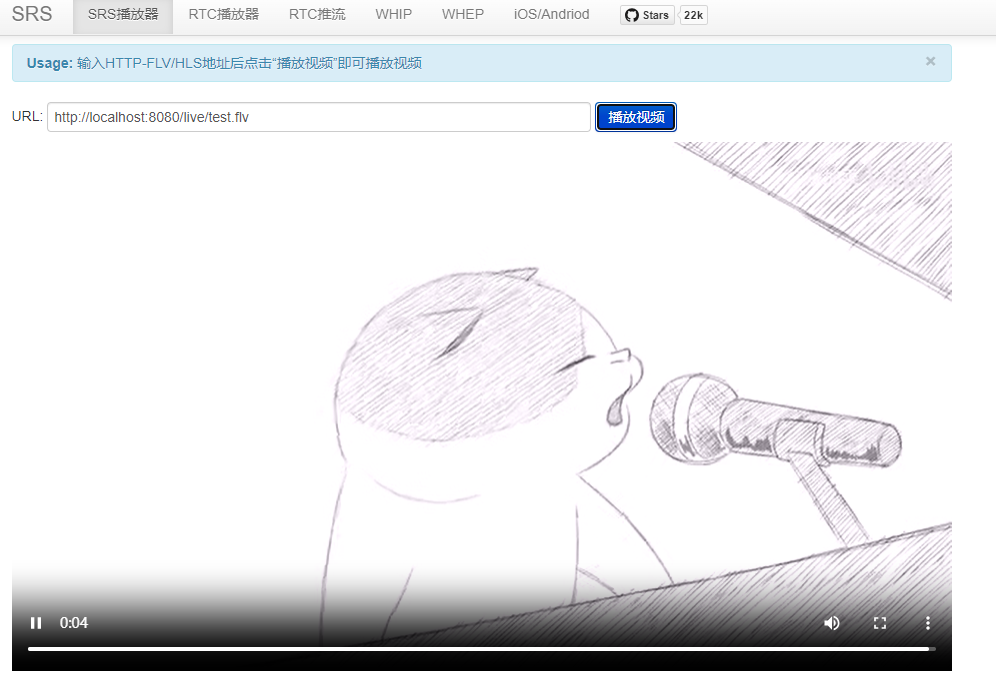

# H.265+SRS6.0服务器部署
SRS从6.0开始，全面支持H.265，包括RTMP、FLV、HLS、GB28181、WebRTC等等。具体的服务器部署及H.265推流步骤如下。
## 1. SRS
> 要支持h265，需要确保SRS的版本为**6.0.4+**
```bash
git clone https://github.com/ossrs/srs.git
./configure --h265=on 
make
```
编译完成后即可启动SRS
```bash
# 启动
./objs/srs -c conf/rtmp.conf
# 查看日志
 tail -n 30 -f ./objs/srs.log
 # 查看服务器状态
./etc/init.d/srs status
 ```

## 2. ffmpeg
rtmp推流封装格式一般为flv，flv原生不支持h265。但是可以通过给ffmpeg打补丁来实现rtmp的h265推流，具体操作如下。
### libx264
编译编码库libx264
<!-- ```bash
git clone https://code.videolan.org/videolan/x264.git
cd x264
mkdir build
./configure --prefix=$(pwd)/build --disable-asm --disable-cli --disable-shared --enable-static
make -j10
make install
``` -->
```bash
git clone https://code.videolan.org/videolan/x264.git
cd x264
mkdir build
./configure --prefix=$(pwd)/build --disable-asm --disable-cli --disable-shared --enable-static
make -j10
make install
```
### libx265
编译编码库libx265
```bash
git clone https://bitbucket.org/multicoreware/x265_git.git
cd x265_git/build/linux
mkdir build
cmake -DCMAKE_INSTALL_PREFIX=$(pwd)/build -DENABLE_SHARED=OFF ../../source
make -j10
make install
```

### 设置环境变量
将libx264和libx265库的路径设置到环境变量中，以在编译ffmpeg时使用。根据自己的x264和x265的安装路径修改PKG_CONFIG_PATH。
```bash
export PKG_CONFIG_PATH=~/x264/build/lib/pkgconfig:~/x265_git/build/linux/build/lib/pkgconfig
```

### ffmpeg补丁
为ffmpeg打补丁，以使rtmp/flv支持h.265
```bash
git clone -b 5.1 https://github.com/runner365/ffmpeg_rtmp_h265.git
cd ffmpeg_rtmp_h265
cp flv.h ~/FFmpeg/libavformat/
cp flv*.c ~/FFmpeg/libavformat/
```

### ffmpeg编译
```bash
git clone https://github.com/FFmpeg/FFmpeg.git
cd FFmpeg
git checkout n5.1.2
mkdir build
./configure \
  --prefix=$(pwd)/build \
  --enable-gpl --enable-nonfree --enable-pthreads --extra-libs=-lpthread \
  --disable-asm --disable-x86asm --disable-inline-asm \
  --enable-decoder=aac --enable-decoder=aac_fixed --enable-decoder=aac_latm --enable-encoder=aac \
  --enable-libx264 --enable-libx265 \
  --pkg-config-flags='--static'
make -j10
```

### 推流
```bash
./ffmpeg -stream_loop -1 -re -i test.flv -c:a copy -c:v libx265 -f flv rtmp://localhost:1935/live/test
```

# 测试

